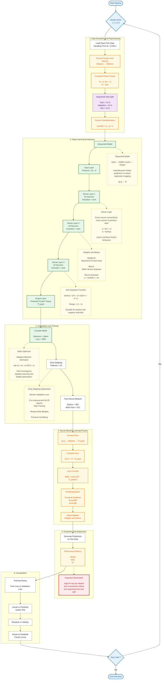

```mermaid
flowchart TD

%% =====================================================
%% STYLES
%% =====================================================

classDef init fill:#e3f2fd,stroke:#1565c0,stroke-width:2px,color:#0d47a1
classDef process fill:#ffffff,stroke:#616161,stroke-width:1px,color:#212121
classDef mathNode fill:#fff8e1,stroke:#f57f17,stroke-width:2px,color:#e65100
classDef split fill:#f3e5f5,stroke:#6a1b9a,stroke-width:1px,color:#4a148c
classDef dl fill:#e8f5e9,stroke:#2e7d32,stroke-width:2px,color:#1b5e20
classDef tooltip fill:#fffde7,stroke:#fbc02d,stroke-width:1px,color:#424242
classDef alert fill:#ffebee,stroke:#c62828,stroke-width:3px,color:#b71c1c

%% =====================================================
%% START
%% =====================================================

A([Start Pipeline]):::init
B{"Iterate Joints<br/>1, 2, 3, 5"}:::init

A --> B

%% =====================================================
%% DATA PROCESSING
%% =====================================================

subgraph Phase1["1. Data Extraction and Preprocessing"]

C["Load Clean CSV Data<br/>Sampling Time dt = 0.005 s"]:::process

D["Convert Position and Velocity<br/>Degrees → Radians"]:::mathNode

E["Compute Friction Torque<br/><br/>Tf = N·Tm + Tj<br/>N = 100"]:::mathNode

F["Sequential Data Split<br/><br/>Train = 70 %<br/>Validation = 15 %<br/>Test = 15 %"]:::split

G["Feature Standardization<br/><br/>xscaled = (x - μ) / σ"]:::mathNode

C --> D
D --> E
E --> F
F --> G

end

%% =====================================================
%% NEURAL NETWORK
%% =====================================================

subgraph Phase2["2. Deep Learning Architecture"]

H["Sequential Model"]:::dl

I["Input Layer<br/>Features = [q , v]"]:::dl

J["Dense Layer 1<br/>64 Neurons<br/>Activation = tanh"]:::dl

K["Dense Layer 2<br/>64 Neurons<br/>Activation = tanh"]:::dl

L["Dense Layer 3<br/>32 Neurons<br/>Activation = tanh"]:::dl

M["Output Layer<br/>Predicted Friction Torque<br/>Tf_pred"]:::dl

%% Explanation Blocks

N["Sequential Model<br/><br/>Input → Hidden Layers → Output<br/><br/>Used because friction prediction is a direct regression mapping<br/><br/>[q,v] → Tf"]:::tooltip

O["Dense Layer<br/><br/>Every neuron connected to every neuron in previous layer<br/><br/>z = W·x + b<br/>a = tanh(z)<br/><br/>Learns nonlinear friction behaviour"]:::tooltip

P1["Weights and Biases<br/><br/>Weight W:<br/>Importance of each input<br/><br/>Bias b:<br/>Shifts neuron response<br/><br/>Neuron Equation<br/>y = tanh(W·x + b)"]:::tooltip

P2["tanh Activation Function<br/><br/>tanh(x) = (e^x - e^-x)/(e^x + e^-x)<br/><br/>Range = [-1 , 1]<br/><br/>Suitable for positive and negative velocities"]:::tooltip

H -.-> N
J -.-> O
K -.-> P1
L -.-> P2

H --> I
I --> J
J --> K
K --> L
L --> M

end

%% =====================================================
%% TRAINING
%% =====================================================

subgraph Phase3["3. Compilation and Training"]

P["Compile Model<br/><br/>Optimizer = Adam<br/>Loss = MSE"]:::dl

Q["Adam Optimizer<br/><br/>Adaptive Moment Estimation<br/><br/>w(t+1) = wt - α·m̂/(√v̂ + ε)<br/><br/>Fast convergence<br/>Adaptive learning rate<br/>Stable optimization"]:::tooltip

R["Early Stopping<br/>Patience = 20"]:::process

S["Early Stopping Explanation<br/><br/>Monitor Validation Loss<br/><br/>If no improvement for 20 epochs<br/>Stop Training<br/><br/>Restore Best Weights<br/><br/>Prevents Overfitting"]:::tooltip

T["Train Neural Network<br/><br/>Epochs = 500<br/>Batch Size = 512"]:::process

P -.-> Q
R -.-> S

P --> R
R --> T

end

%% =====================================================
%% LEARNING MECHANISM
%% =====================================================

subgraph Phase4["4. Neural Network Learning Process"]

U1["Forward Pass<br/><br/>[q,v] → Network → Tf_pred"]:::mathNode

U2["Compute Error<br/><br/>Error = Tf - Tf_pred"]:::mathNode

U3["Loss Function<br/><br/>MSE = (1/n) Σ(Tf - Tf_pred)^2"]:::mathNode

U4["Backpropagation<br/><br/>Compute Gradients<br/>∂Loss/∂W<br/>∂Loss/∂b"]:::mathNode

U5["Adam Updates<br/>Weights and Biases"]:::mathNode

U1 --> U2
U2 --> U3
U3 --> U4
U4 --> U5

end

%% =====================================================
%% EVALUATION
%% =====================================================

subgraph Phase5["5. Evaluation and Diagnostics"]

V["Generate Predictions<br/>on Test Data"]:::process

W["Performance Metrics<br/><br/>RMSE<br/>MAE<br/>R²"]:::mathNode

X["Important Observation<br/><br/>High R² may be inflated<br/>due to hysteresis effects<br/>and sequential train-test split"]:::alert

V --> W
W -.-> X

end

%% =====================================================
%% VISUALIZATION
%% =====================================================

subgraph Phase6["6. Visualization"]

Y["Training History<br/><br/>Train Loss vs Validation Loss"]:::process

Z["Actual vs Predicted<br/>Scatter Plot"]:::process

AA["Residual vs Velocity"]:::process

AB["Actual vs Predicted<br/>Friction Curve"]:::process

Y --> Z
Z --> AA
AA --> AB

end

%% =====================================================
%% PIPELINE CONNECTIONS
%% =====================================================

B --> C

G --> H

M --> P

T --> U1

U5 --> V

W --> Y

AB --> AC{"Next Joint ?"}:::init

AC -- Yes --> B

AC -- No --> AD([End Execution]):::init
```