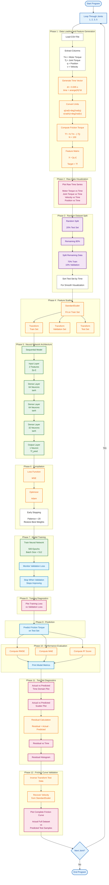

```mermaid
flowchart TD

%% =====================================================
%% STYLES
%% =====================================================

classDef start fill:#e3f2fd,stroke:#1565c0,stroke-width:2px,color:#0d47a1
classDef process fill:#ffffff,stroke:#616161,stroke-width:1px,color:#212121
classDef math fill:#fff8e1,stroke:#f57f17,stroke-width:2px,color:#e65100
classDef split fill:#f3e5f5,stroke:#6a1b9a,stroke-width:2px,color:#4a148c
classDef dl fill:#e8f5e9,stroke:#2e7d32,stroke-width:2px,color:#1b5e20
classDef eval fill:#e1f5fe,stroke:#0277bd,stroke-width:2px,color:#01579b
classDef plot fill:#fce4ec,stroke:#ad1457,stroke-width:2px,color:#880e4f

%% =====================================================
%% START
%% =====================================================

A([Start Program]):::start

B["Loop Through Joints<br/>1, 2, 3, 5"]:::start

A --> B

%% =====================================================
%% DATA LOADING
%% =====================================================

subgraph P1["Phase 1 : Data Loading and Feature Generation"]

C["Load CSV File"]:::process

D["Extract Columns<br/><br/>Tm = Motor Torque<br/>Tj = Joint Torque<br/>q = Position<br/>v = Velocity"]:::process

E["Generate Time Vector<br/><br/>dt = 0.005 s<br/>time = arange(N)*dt"]:::math

F["Convert Units<br/><br/>q(rad)=deg2rad(q)<br/>v(rad/s)=deg2rad(v)"]:::math

G["Compute Friction Torque<br/><br/>Tf = N·Tm - (-Tj)<br/>N = 100"]:::math

H["Feature Matrix<br/><br/>X = [q,v]<br/><br/>Target = Tf"]:::math

C --> D
D --> E
E --> F
F --> G
G --> H

end

%% =====================================================
%% RAW DATA VISUALIZATION
%% =====================================================

subgraph P2["Phase 2 : Raw Data Visualization"]

I["Plot Raw Time Series<br/><br/>Motor Torque vs Time<br/>Joint Torque vs Time<br/>Velocity vs Time<br/>Position vs Time"]:::plot

end

%% =====================================================
%% RANDOM SPLIT
%% =====================================================

subgraph P3["Phase 3 : Random Dataset Split"]

J["Random Split<br/><br/>20% Test Set"]:::split

K["Remaining 80%"]:::split

L["Split Remaining Data<br/><br/>70% Train<br/>10% Validation"]:::split

M["Sort Test Set by Time<br/><br/>For Smooth Visualization"]:::process

J --> K
K --> L
L --> M

end

%% =====================================================
%% SCALING
%% =====================================================

subgraph P4["Phase 4 : Feature Scaling"]

N["StandardScaler<br/><br/>Fit on Train Set"]:::math

O["Transform<br/>Train Set"]:::math

P["Transform<br/>Validation Set"]:::math

Q["Transform<br/>Test Set"]:::math

N --> O
N --> P
N --> Q

end

%% =====================================================
%% NEURAL NETWORK
%% =====================================================

subgraph P5["Phase 5 : Neural Network Architecture"]

R["Sequential Model"]:::dl

S["Input Layer<br/>2 Features<br/>[q,v]"]:::dl

T["Dense Layer<br/>64 Neurons<br/>tanh"]:::dl

U["Dense Layer<br/>64 Neurons<br/>tanh"]:::dl

V["Dense Layer<br/>32 Neurons<br/>tanh"]:::dl

W["Output Layer<br/>1 Neuron<br/>Tf_pred"]:::dl

R --> S
S --> T
T --> U
U --> V
V --> W

end

%% =====================================================
%% MODEL COMPILATION
%% =====================================================

subgraph P6["Phase 6 : Compilation"]

X["Loss Function<br/><br/>MSE"]:::math

Y["Optimizer<br/><br/>Adam"]:::math

Z["Early Stopping<br/><br/>Patience = 20<br/>Restore Best Weights"]:::process

X --> Y
Y --> Z

end

%% =====================================================
%% TRAINING
%% =====================================================

subgraph P7["Phase 7 : Model Training"]

AA["Train Neural Network<br/><br/>500 Epochs<br/>Batch Size = 512"]:::dl

AB["Monitor Validation Loss"]:::eval

AC["Stop When Validation<br/>Stops Improving"]:::eval

AA --> AB
AB --> AC

end

%% =====================================================
%% TRAINING HISTORY
%% =====================================================

subgraph P8["Phase 8 : Training Diagnostics"]

AD["Plot Training Loss<br/>vs Validation Loss"]:::plot

end

%% =====================================================
%% PREDICTION
%% =====================================================

subgraph P9["Phase 9 : Prediction"]

AE["Predict Friction Torque<br/>on Test Set"]:::eval

end

%% =====================================================
%% EVALUATION
%% =====================================================

subgraph P10["Phase 10 : Performance Evaluation"]

AF["Compute RMSE"]:::math

AG["Compute MAE"]:::math

AH["Compute R² Score"]:::math

AI["Print Model Metrics"]:::eval

AF --> AI
AG --> AI
AH --> AI

end

%% =====================================================
%% TEST SET ANALYSIS
%% =====================================================

subgraph P11["Phase 11 : Test Set Diagnostics"]

AJ["Actual vs Predicted<br/>Time Domain Plot"]:::plot

AK["Actual vs Predicted<br/>Scatter Plot"]:::plot

AL["Residual Calculation<br/><br/>Residual = Actual - Predicted"]:::math

AM["Residual vs Time"]:::plot

AN["Residual Histogram"]:::plot

AJ --> AK
AK --> AL
AL --> AM
AM --> AN

end

%% =====================================================
%% FRICTION CURVE
%% =====================================================

subgraph P12["Phase 12 : Friction Curve Validation"]

AO["Inverse Transform Test Data"]:::math

AP["Recover Velocity<br/>from StandardScaler"]:::math

AQ["Plot Complete Friction Curve<br/><br/>Actual Full Dataset<br/>vs<br/>Predicted Test Samples"]:::plot

AO --> AP
AP --> AQ

end

%% =====================================================
%% LOOP CONNECTIONS
%% =====================================================

B --> C

H --> I

I --> J

M --> N

O --> R

W --> X

Z --> AA

AC --> AD

AD --> AE

AE --> AF
AE --> AG
AE --> AH

AI --> AJ

AN --> AO

AQ --> AR{"Next Joint?"}:::start

AR -- Yes --> B

AR -- No --> AS([End Program]):::start
```