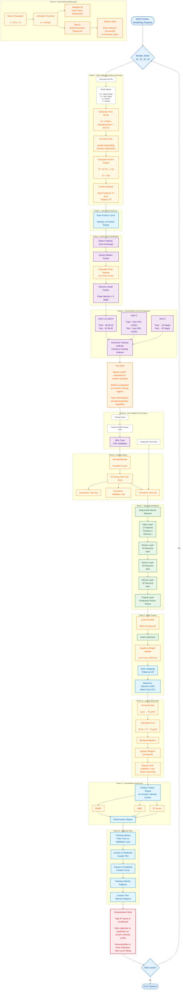

```mermaid
flowchart TD

%% =====================================================
%% STYLES
%% =====================================================

classDef start fill:#e3f2fd,stroke:#1565c0,stroke-width:2px,color:#0d47a1,font-size:24px
classDef process fill:#ffffff,stroke:#616161,stroke-width:1px,color:#212121,font-size:22pxx
classDef math fill:#fff8e1,stroke:#f57f17,stroke-width:2px,color:#e65100,font-size:22px
classDef split fill:#f3e5f5,stroke:#6a1b9a,stroke-width:2px,color:#4a148c,font-size:22px
classDef dl fill:#e8f5e9,stroke:#2e7d32,stroke-width:2px,color:#1b5e20,font-size:22px
classDef eval fill:#e1f5fe,stroke:#0277bd,stroke-width:2px,color:#01579b,font-size:22px
classDef note fill:#fff3e0,stroke:#ef6c00,stroke-width:2px,color:#e65100,font-size:22px
classDef warn fill:#ffebee,stroke:#c62828,stroke-width:3px,color:#b71c1c,font-size:22px

%% =====================================================
%% START
%% =====================================================

A([Start Friction Modelling Pipeline]):::start

B{"Iterate Joints<br/>J1, J2, J3, J5"}:::start

A --> B

%% =====================================================
%% DATA ACQUISITION
%% =====================================================

subgraph P1["Phase 1 : Data Loading and Feature Generation"]

C["Load Joint CSV File"]:::process

D["Extract Signals<br/><br/>Tm = Motor Torque<br/>Tj = Joint Torque<br/>q = Position<br/>v = Velocity"]:::process

E["Generate Time Vector<br/><br/>dt = 0.005 s<br/>Sampling Rate = 200 Hz"]:::math

F["Convert Units<br/><br/>q(rad)=deg2rad(q)<br/>v(rad/s)=deg2rad(v)"]:::math

G["Compute Friction Torque<br/><br/>Tf = N·Tm - (-Tj)<br/><br/>N = 100"]:::math

H["Create Dataset<br/><br/>Input Features X=[q,v]<br/>Target y=Tf"]:::math

C --> D
D --> E
E --> F
F --> G
G --> H

end

%% =====================================================
%% RAW DATA
%% =====================================================

subgraph P2["Phase 2 : Raw Friction Behaviour"]

I["Raw Friction Curve<br/><br/>Velocity vs Friction Torque"]:::eval

end

%% =====================================================
%% CYCLE DETECTION
%% =====================================================

subgraph P3["Phase 3 : Motion Cycle Identification"]

J["Detect Velocity Zero Crossings"]:::split

K["Extract Motion Cycles"]:::split

L["Calculate Peak Velocity<br/>for Every Cycle"]:::math

M["Remove Small Cycles<br/><br/>Peak Velocity < 5 deg/s"]:::split

J --> K
K --> L
L --> M

end

%% =====================================================
%% OPERATING REGION SPLIT
%% =====================================================

subgraph P4["Phase 4 : Physics-Based Train/Test Separation"]

N["Joint 1 & Joint 5<br/><br/>Train : 30,36,42<br/>Test : 33,39,45"]:::split

O["Joint 2<br/><br/>Train : First 75% Cycles<br/>Test : Last 25% Cycles"]:::split

P["Joint 3<br/><br/>Train : ~42 deg/s<br/>Test : ~32 deg/s"]:::split

Q["Construct Training Indexes<br/>Construct Testing Indexes"]:::split

N --> Q
O --> Q
P --> Q

end

%% =====================================================
%% IMPORTANT NOTE
%% =====================================================

R["Key Idea<br/><br/>Model is NOT evaluated on random samples<br/><br/>Model is evaluated on unseen velocity regions<br/><br/>Tests interpolation and generalization capability"]:::note

%% =====================================================
%% TRAIN VAL TEST
%% =====================================================

subgraph P5["Phase 5 : Train Validation Test Creation"]

S["Training Cycles"]:::process

T["Random Shuffle Training Data"]:::process

U["90% Train<br/>10% Validation"]:::split

V["Independent Test Cycles"]:::process

S --> T
T --> U

end

%% =====================================================
%% NORMALIZATION
%% =====================================================

subgraph P6["Phase 6 : Feature Scaling"]

W["StandardScaler<br/><br/>xscaled=(x-μ)/σ"]:::math

X["Fit Using Train Set Only"]:::math

Y["Transform Train Set"]:::math

Z["Transform Validation Set"]:::math

AA["Transform Test Set"]:::math

W --> X
X --> Y
X --> Z
X --> AA

end

%% =====================================================
%% NEURAL NETWORK
%% =====================================================

subgraph P7["Phase 7 : Deep Neural Network"]

AB["Sequential Neural Network"]:::dl

AC["Input Layer<br/>2 Features<br/>Position q<br/>Velocity v"]:::dl

AD["Dense Layer<br/>64 Neurons<br/>tanh"]:::dl

AE["Dense Layer<br/>64 Neurons<br/>tanh"]:::dl

AF["Dense Layer<br/>32 Neurons<br/>tanh"]:::dl

AG["Output Layer<br/>Predicted Friction Torque"]:::dl

AB --> AC
AC --> AD
AD --> AE
AE --> AF
AF --> AG

end

%% =====================================================
%% NN EXPLANATION
%% =====================================================

subgraph P8["Phase 8 : Neural Network Mathematics"]

AH["Neuron Equation<br/><br/>z = W·x + b"]:::math

AI["Activation Function<br/><br/>a = tanh(z)"]:::math

AJ["Weights W<br/>Learn Input Importance"]:::note

AK["Bias b<br/>Shifts Activation Response"]:::note

AL["Dense Layer<br/><br/>Every Neuron Connected<br/>to Previous Layer"]:::note

AH --> AI
AI --> AJ
AI --> AK
AK --> AL

end

%% =====================================================
%% TRAINING
%% =====================================================

subgraph P9["Phase 9 : Model Training"]

AM["Loss Function<br/><br/>MSE=(1/n)Σ(y-ŷ)²"]:::math

AN["Adam Optimizer"]:::dl

AO["Adaptive Weight Update<br/><br/>wt+1=wt-α·m̂/(√v̂+ε)"]:::math

AP["Early Stopping<br/>Patience=20"]:::eval

AQ["Maximum Epochs=1000<br/>Batch Size=512"]:::eval

AM --> AN
AN --> AO
AO --> AP
AP --> AQ

end

%% =====================================================
%% LEARNING PROCESS
%% =====================================================

subgraph P10["Phase 10 : Learning Mechanism"]

AR["Forward Pass<br/><br/>[q,v] → Tf_pred"]:::math

AS["Calculate Error<br/><br/>Error = Tf - Tf_pred"]:::math

AT["Backpropagation"]:::math

AU["Update Weights and Biases"]:::math

AV["Repeat Until Validation Loss Stops Improving"]:::math

AR --> AS
AS --> AT
AT --> AU
AU --> AV

end

%% =====================================================
%% EVALUATION
%% =====================================================

subgraph P11["Phase 11 : Generalization Assessment"]

AW["Predict Friction Torque<br/>on Unseen Velocity Cycles"]:::eval

AX["RMSE"]:::math

AY["MAE"]:::math

AZ["R² Score"]:::math

BA["Performance Report"]:::eval

AX --> BA
AY --> BA
AZ --> BA

end

%% =====================================================
%% VISUALIZATION
%% =====================================================

subgraph P12["Phase 12 : Diagnostic Plots"]

BB["Training History<br/>Train Loss vs Validation Loss"]:::eval

BC["Actual vs Predicted<br/>Scatter Plot"]:::eval

BD["Actual vs Predicted<br/>Friction Curve"]:::eval

BE["Training Velocity Regions"]:::eval

BF["Unseen Test Velocity Regions"]:::eval

BB --> BC
BC --> BD
BD --> BE
BE --> BF

end

%% =====================================================
%% WARNING
%% =====================================================

BG["Interpretation Note<br/><br/>High R² alone is insufficient<br/><br/>Main objective is prediction on unseen velocity cycles<br/><br/>Generalization is more important than curve fitting"]:::warn

%% =====================================================
%% FLOW CONNECTIONS
%% =====================================================

B --> C

H --> I

I --> J

M --> N

Q --> R

R --> S

U --> W

V --> AA

AA --> AB

AG --> AM

AQ --> AR

AV --> AW

AW --> AX
AW --> AY
AW --> AZ

BA --> BB

BF --> BG

BG --> BH{"Next Joint?"}:::start

BH -- Yes --> B

BH -- No --> BI([End Pipeline]):::start
```