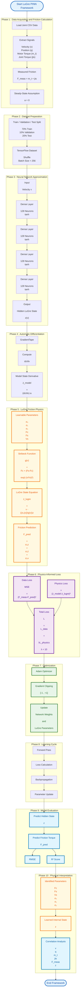

```mermaid
flowchart TD

%% ==========================================
%% STYLES
%% ==========================================

classDef start fill:#E3F2FD,stroke:#1565C0,stroke-width:3px,color:#0D47A1,font-size:18px
classDef process fill:#FFFFFF,stroke:#616161,stroke-width:2px,color:#212121,font-size:16px
classDef physics fill:#FFF8E1,stroke:#F57F17,stroke-width:3px,color:#E65100,font-size:16px
classDef nn fill:#E8F5E9,stroke:#2E7D32,stroke-width:3px,color:#1B5E20,font-size:16px
classDef loss fill:#F3E5F5,stroke:#6A1B9A,stroke-width:3px,color:#4A148C,font-size:16px
classDef eval fill:#E1F5FE,stroke:#0277BD,stroke-width:3px,color:#01579B,font-size:16px

%% ==========================================
%% PIPELINE
%% ==========================================

A([Start LuGre PINN Framework]):::start

A --> B

%% ==========================================
%% DATA
%% ==========================================

subgraph P1["Phase 1 : Data Acquisition and Friction Calculation"]

B["Load Joint CSV Data"]

C["Extract Signals

Velocity (v)
Position (q)
Motor Torque (m_t)
Joint Torque (jts)"]

D["Measured Friction

F_meas = m_t + jts"]

E["Steady-State Assumption

a = 0"]

B --> C
C --> D
D --> E

end

%% ==========================================
%% DATA SPLIT
%% ==========================================

E --> F

subgraph P2["Phase 2 : Dataset Preparation"]

F["Train / Validation / Test Split

70% Train
10% Validation
20% Test"]

G["TensorFlow Dataset

Shuffle
Batch Size = 256"]

F --> G

end

%% ==========================================
%% PINN
%% ==========================================

G --> H

subgraph P3["Phase 3 : Neural Network Approximation"]

H["Input

Velocity v"]

I["Dense Layer

128 Neurons
tanh"]

J["Dense Layer

128 Neurons
tanh"]

K["Dense Layer

128 Neurons
tanh"]

L["Dense Layer

128 Neurons
tanh"]

M["Output

Hidden LuGre State

z(v)"]

H --> I
I --> J
J --> K
K --> L
L --> M

end

%% ==========================================
%% AUTODIFF
%% ==========================================

M --> N

subgraph P4["Phase 4 : Automatic Differentiation"]

N["GradientTape"]

O["Compute

dz/dv"]

P["Model State Derivative

ż_model

=
(dz/dv)·a"]

N --> O
O --> P

end

%% ==========================================
%% LUGRE PHYSICS
%% ==========================================

P --> Q

subgraph P5["Phase 5 : LuGre Friction Physics"]

Q["Learnable Parameters

σ₀
σ₁
σ₂
Fc
Fs
Vs"]:::physics

R["Stribeck Function

g(v)

=
Fc + (Fs-Fc)

exp(-(v/Vs)²)"]:::physics

S["LuGre State Equation

ż_lugre

=
v -
((σ₀|v|)/g(v))z"]:::physics

T["Friction Prediction

F_pred

=
σ₀z
+
σ₁ż
+
σ₂v"]:::physics

Q --> R
R --> S
S --> T

end

%% ==========================================
%% LOSS
%% ==========================================

T --> U

subgraph P6["Phase 6 : Physics-Informed Loss"]

U["Data Loss

MSE

=
(F_meas-F_pred)²"]:::loss

V["Physics Loss

=
(ż_model-ż_lugre)²"]:::loss

W["Total Loss

L

=
L_data

+

λL_physics

λ = 10"]:::loss

U --> W
V --> W

end

%% ==========================================
%% OPTIMIZATION
%% ==========================================

W --> X

subgraph P7["Phase 7 : Optimization"]

X["Adam Optimizer"]:::nn

Y["Gradient Clipping

[-1 , +1]"]:::nn

Z["Update

Network Weights

and

LuGre Parameters"]:::nn

X --> Y
Y --> Z

end

%% ==========================================
%% TRAINING LOOP
%% ==========================================

Z --> AA

subgraph P8["Phase 8 : Learning Cycle"]

AA["Forward Pass"]

AB["Loss Calculation"]

AC["Backpropagation"]

AD["Parameter Update"]

AA --> AB
AB --> AC
AC --> AD

end

%% ==========================================
%% EVALUATION
%% ==========================================

AD --> AE

subgraph P9["Phase 9 : Model Evaluation"]

AE["Predict Hidden State

z"]:::eval

AF["Predict Friction Torque

F_pred"]:::eval

AG["RMSE"]:::eval

AH["R² Score"]:::eval

AE --> AF
AF --> AG
AF --> AH

end

%% ==========================================
%% INTERPRETABILITY
%% ==========================================

AH --> AI

subgraph P10["Phase 10 : Physical Interpretation"]

AI["Identified Parameters

Fc
Fs
Vs
σ₀
σ₁
σ₂"]:::physics

AJ["Learned Internal State

z"]:::physics

AK["Correlation Analysis

v
q
m_t
jts
F_meas
z"]:::eval

AI --> AJ
AJ --> AK

end

AK --> AL([End Framework]):::start
```