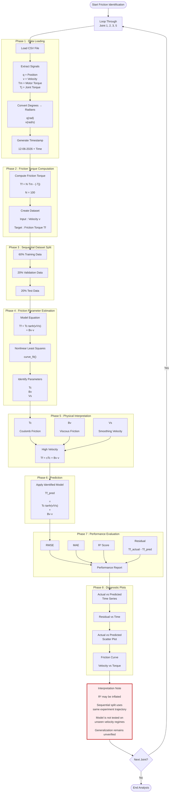

```mermaid
flowchart TD

%% =====================================================
%% STYLES
%% =====================================================

classDef start fill:#E3F2FD,stroke:#1565C0,stroke-width:3px
classDef process fill:#FFFFFF,stroke:#616161,stroke-width:2px
classDef math fill:#FFF8E1,stroke:#F57F17,stroke-width:3px
classDef split fill:#F3E5F5,stroke:#6A1B9A,stroke-width:3px
classDef model fill:#E8F5E9,stroke:#2E7D32,stroke-width:3px
classDef eval fill:#E1F5FE,stroke:#0277BD,stroke-width:3px
classDef warn fill:#FFEBEE,stroke:#C62828,stroke-width:3px

%% =====================================================
%% START
%% =====================================================

A([Start Friction Identification])

A --> B

B["Loop Through<br/>Joint 1, 2, 3, 5"]

%% =====================================================
%% DATA LOADING
%% =====================================================

B --> C

subgraph P1["Phase 1 : Data Loading"]

C["Load CSV File"]

D["Extract Signals

q = Position
v = Velocity
Tm = Motor Torque
Tj = Joint Torque"]

E["Convert Degrees → Radians

q(rad)
v(rad/s)"]

F["Generate Timestamp

12-06-2026 + Time"]

C --> D
D --> E
E --> F

end

%% =====================================================
%% FRICTION CALCULATION
%% =====================================================

F --> G

subgraph P2["Phase 2 : Friction Torque Computation"]

G["Compute Friction Torque

Tf = N·Tm - (-Tj)

N = 100"]

H["Create Dataset

Input : Velocity v

Target : Friction Torque Tf"]

G --> H

end

%% =====================================================
%% DATA SPLIT
%% =====================================================

H --> I

subgraph P3["Phase 3 : Sequential Dataset Split"]

I["60% Training Data"]

J["20% Validation Data"]

K["20% Test Data"]

I --> J
J --> K

end

%% =====================================================
%% PARAMETER IDENTIFICATION
%% =====================================================

K --> L

subgraph P4["Phase 4 : Friction Parameter Estimation"]

L["Model Equation

Tf = Tc·tanh(v/Vs)
+ Bv·v"]

M["Nonlinear Least Squares

curve_fit()"]

N["Identify Parameters

Tc
Bv
Vs"]

L --> M
M --> N

end

%% =====================================================
%% MODEL PHYSICS
%% =====================================================

N --> O

subgraph P5["Phase 5 : Physical Interpretation"]

O["Tc

Coulomb Friction"]

P["Bv

Viscous Friction"]

Q["Vs

Smoothing Velocity"]

R["High Velocity

Tf ≈ ±Tc + Bv·v"]

O --> R
P --> R
Q --> R

end

%% =====================================================
%% PREDICTION
%% =====================================================

R --> S

subgraph P6["Phase 6 : Prediction"]

S["Apply Identified Model

Tf_pred

=
Tc·tanh(v/Vs)
+
Bv·v"]

end

%% =====================================================
%% EVALUATION
%% =====================================================

S --> T

subgraph P7["Phase 7 : Performance Evaluation"]

T["RMSE"]

U["MAE"]

V["R² Score"]

W["Residual

Tf_actual - Tf_pred"]

T --> X
U --> X
V --> X
W --> X

X["Performance Report"]

end

%% =====================================================
%% VISUALIZATION
%% =====================================================

X --> Y

subgraph P8["Phase 8 : Diagnostic Plots"]

Y["Actual vs Predicted
Time Series"]

Z["Residual vs Time"]

AA["Actual vs Predicted
Scatter Plot"]

AB["Friction Curve

Velocity vs Torque"]

Y --> Z
Z --> AA
AA --> AB

end

%% =====================================================
%% LIMITATION
%% =====================================================

AB --> AC

AC["Interpretation Note

R² may be inflated

Sequential split uses
same experiment trajectory

Model is not tested on
unseen velocity regimes

Generalization remains unverified"]:::warn

AC --> AD{"Next Joint?"}

AD -- Yes --> B

AD -- No --> AE([End Analysis])
```