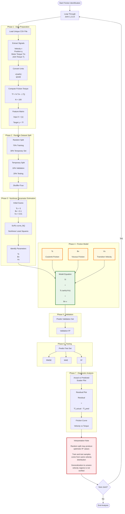

```mermaid
flowchart TD

%% ==========================================
%% STYLES
%% ==========================================

classDef start fill:#E3F2FD,stroke:#1565C0,stroke-width:3px
classDef process fill:#FFFFFF,stroke:#616161,stroke-width:2px
classDef model fill:#E8F5E9,stroke:#2E7D32,stroke-width:3px
classDef math fill:#FFF8E1,stroke:#F57F17,stroke-width:3px
classDef eval fill:#E1F5FE,stroke:#0277BD,stroke-width:3px
classDef warn fill:#FFEBEE,stroke:#C62828,stroke-width:3px

%% ==========================================
%% START
%% ==========================================

A([Start Friction Identification])

A --> B

B["Loop Through
Joint 1,2,3,5"]

%% ==========================================
%% DATA PREPARATION
%% ==========================================

B --> C

subgraph P1["Phase 1 : Data Preparation"]

C["Load Unique CSV File"]

D["Extract Signals

Velocity v
Position q
Motor Torque Tm
Joint Torque Tj"]

E["Convert Units

v(rad/s)
q(rad)"]

F["Compute Friction Torque

Tf = N·Tm - (-Tj)

N = 100"]

G["Feature Matrix

Input X = [v]

Target y = Tf"]

C --> D
D --> E
E --> F
F --> G

end

%% ==========================================
%% RANDOM SPLIT
%% ==========================================

G --> H

subgraph P2["Phase 2 : Random Dataset Split"]

H["Random Split

70% Training

30% Temporary Set"]

I["Temporary Split

10% Validation

20% Testing"]

J["Shuffle=True"]

H --> I
I --> J

end

%% ==========================================
%% PARAMETER IDENTIFICATION
%% ==========================================

J --> K

subgraph P3["Phase 3 : Nonlinear Parameter Estimation"]

K["Initial Guess

Tc = 5
Bv = 0.1
Vs = 0.01"]

L["SciPy curve_fit()

Nonlinear Least Squares"]

M["Identify Parameters

Tc
Bv
Vs"]

K --> L
L --> M

end

%% ==========================================
%% MODEL PHYSICS
%% ==========================================

M --> N

subgraph P4["Phase 4 : Friction Model"]

N["Model Equation

Tf

=

Tc tanh(v/Vs)

+

Bv·v"]:::model

O["Tc

Coulomb Friction"]:::math

P["Bv

Viscous Friction"]:::math

Q["Vs

Transition Velocity"]:::math

O --> N
P --> N
Q --> N

end

%% ==========================================
%% VALIDATION
%% ==========================================

N --> R

subgraph P5["Phase 5 : Validation"]

R["Predict Validation Set"]

S["Validation R²"]

R --> S

end

%% ==========================================
%% TESTING
%% ==========================================

S --> T

subgraph P6["Phase 6 : Testing"]

T["Predict Test Set"]

U["RMSE"]

V["MAE"]

W["R²"]

T --> U
T --> V
T --> W

end

%% ==========================================
%% DIAGNOSTIC ANALYSIS
%% ==========================================

W --> X

subgraph P7["Phase 7 : Diagnostic Analysis"]

X["Actual vs Predicted
Scatter Plot"]

Y["Residual Plot

Residual

=

Tf_actual - Tf_pred"]

Z["Friction Curve

Velocity vs Torque"]

X --> Y
Y --> Z

end

%% ==========================================
%% INTERPRETATION
%% ==========================================

Z --> AA

AA["Interpretation Note

Random split may produce
optimistic R² values

Train and test samples
come from same velocity
distribution

Generalization to unseen
velocity regions is not verified"]:::warn

AA --> AB{"Next Joint?"}

AB -- Yes --> B

AB -- No --> AC([End Analysis])
```